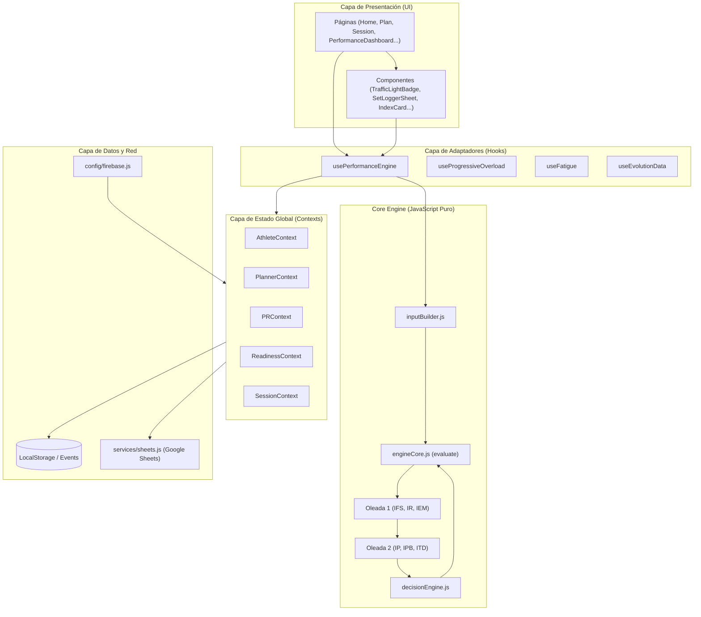
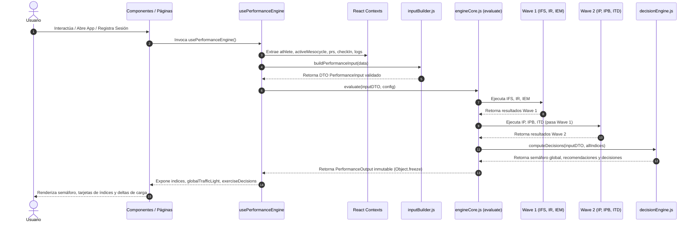

# ARCHITECTURE — TrainingOS

## 1. Arquitectura General
TrainingOS sigue una arquitectura de capas bien definida que separa estrictamente la **interfaz de usuario (React)**, la **gestión de estado de la aplicación (React Context API)**, la **capa de red/persistencia (Services & LocalStorage)** y el **Motor de Rendimiento Puro (Performance Engine)**.



---

## 2. Principios de Arquitectura y Patrones
1. **Desacoplamiento Absoluto del Performance Engine**:
   - Ubicado en `src/engine/performance/`.
   - **Cero dependencias** de React, Hooks, DOM o `localStorage`.
   - Funciones puras e inmutables: `evaluate(inputDTO, config) -> PerformanceOutput`.
   - Garantiza que todo el motor puede ser testeado en entornos Node.js o CLI (`smoke.test.js`) sin compilar JSX.

2. **React Context Provider Pattern**:
   - Los datos globales se encapsulan en Contextos temáticos (`AthleteContext`, `PlannerContext`, `PRContext`, `ReadinessContext`, `SessionContext`).
   - Cada Provider gestiona la inicialización de estado desde `localStorage` e impulsa la sincronización reactiva.

3. **Event-Driven Reactive Storage Synchronization**:
   - Cuando se modifica una sesión, check-in o PR en la aplicación, se emite un evento personalizado del sistema de eventos del navegador (`window.dispatchEvent(new Event('session_logs_updated'))`).
   - Los hooks suscriptores reaccionan inmediatamente actualizando el estado de la UI sin requerir recargas de página.

4. **Single Source of Truth (SSOT)**:
   - `localStorage` actúa como la base de datos principal local-first.
   - Google Sheets y Firebase actúan como capa de sincronización remota opcional / diferida (`_bgSync`).

---

## 3. Estructura de Carpetas del Proyecto

```text
src/
├── components/          # Componentes de UI reutilizables
│   ├── performance/     # Componentes visuales del Performance Engine (TrafficLight, IndexCard...)
│   ├── planner/         # Componentes del planificador (EditableBlock, SessionReadView...)
│   └── timer/           # Componentes del cronómetro/circuito (CircuitPlayer, CountdownRing...)
├── config/              # Configuración de servicios externos (firebase.js)
├── context/             # Proveedores de estado de React (Athlete, Planner, PR, Readiness, Session...)
├── data/                # Definiciones estáticas, librería de ejercicios y mocks iniciales
│   ├── exerciseLibrary.js   # 35 ejercicios con metadatos (pattern, systemicCost, sportTransfer)
│   ├── exerciseMetadata.js  # Gestor de overrides de entrenador y valores por categoría
│   └── mockPlanner.js       # Datos iniciales de temporadas y mesociclos
├── engine/              # Performance Engine (JavaScript puro desacoplado)
│   └── performance/
│       ├── core/        # Orquestador (engineCore.js) y motor de decisiones (decisionEngine.js)
│       ├── indices/     # Los 6 índices de rendimiento (Wave 1 + Wave 2)
│       ├── utils/       # Constructores DTO, validadores, decay y estimadores 1RM
│       ├── __tests__/   # Suite de tests automáticos (smoke.test.js)
│       └── index.js     # Punto de entrada público del motor
├── hooks/               # Hooks adaptadores de React (usePerformanceEngine, useProgressiveOverload...)
├── pages/               # Vistas principales de la aplicación (Home, Plan, Session, PerformanceDashboard...)
│   ├── coach/           # Vistas exclusivas para entrenadores
│   └── planner/         # Vistas secundarias del planificador
├── services/            # Cliente de red y sincronización con Google Sheets API (sheets.js)
└── utils/               # Utilidades de audio, parser de Excel y sobrecarga progresiva
```

---

## 4. Flujo de Datos y Separación entre UI y Lógica


