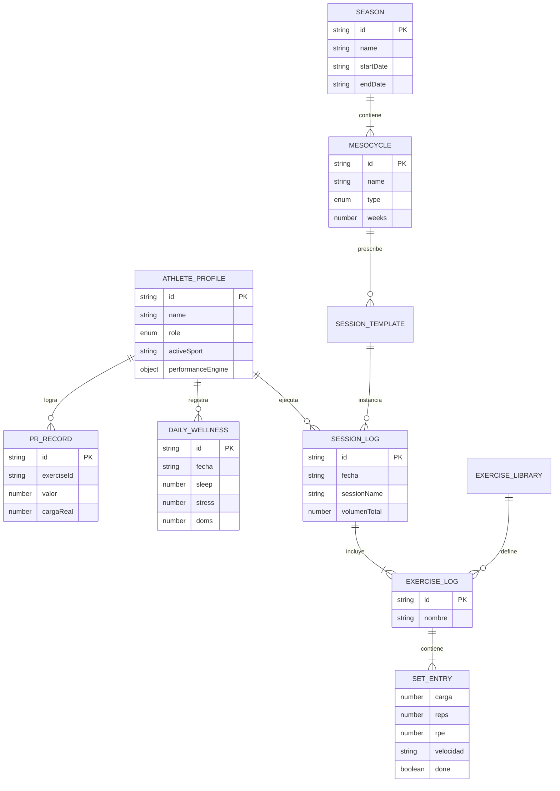

# DATABASE & DATA MODELS — TrainingOS

## 1. Visión General del Modelo de Datos
TrainingOS opera bajo un paradigma **Local-First (Storage en Browser)** con sincronización transparente a **Google Sheets** (filas tabulares) y **Firebase** (autenticación). No existe una base de datos relacional SQL directa, sino un esquema DTO documentado con entidades persistidas en JSON claves/valores.

---

## 2. Entidades Principales

### 2.1. AthleteProfile (`trainingos_athlete_profile`)
| Campo | Tipo | Requerido | Descripción |
|---|---|---|---|
| `id` | `string` | Sí | Identificador único (`atleta-{timestamp}`) |
| `name` | `string` | Sí | Nombre completo del atleta |
| `role` | `enum` | Sí | `'athlete'` \| `'coach'` \| `'both'` |
| `activeSport` | `string` | Sí | `'all'` \| `'gym'` \| `'tkd'` \| `'cardio'` |
| `primarySport` | `string` | Sí | Deporte primario (default: `'gym'`) |
| `level` | `enum` | Sí | `'novato'` \| `'intermedio'` \| `'avanzado'` |
| `onboardingCompleted` | `boolean` | Sí | Flag de estado de onboarding |
| `performanceEngine` | `object` | Sí | Configuración `{ enabled: boolean, disabledAt, disabledReason }` |

### 2.2. Season (`trainingos_seasons`)
| Campo | Tipo | Requerido | Descripción |
|---|---|---|---|
| `id` | `string` | Sí | ID único de la temporada (`season-1`) |
| `name` | `string` | Sí | Nombre (ej. "Temporada 2025-26") |
| `startDate` | `string (ISO)`| Sí | Fecha de inicio (YYYY-MM-DD) |
| `endDate` | `string (ISO)`| Sí | Fecha de finalización |
| `status` | `enum` | Sí | `'active'` \| `'finished'` \| `'upcoming'` |
| `sport` | `string` | Sí | Deporte objetivo |
| `mesocycles` | `array<Mesocycle>`| Sí | Lista de mesociclos anidados |

### 2.3. Mesocycle (Objeto anidado en Season)
| Campo | Tipo | Requerido | Descripción |
|---|---|---|---|
| `id` | `string` | Sí | ID único del bloque (`meso-1`) |
| `name` | `string` | Sí | Nombre del mesociclo ("Bloque Fuerza") |
| `type` | `enum` | Sí | `'fuerza'` \| `'hipertrofia'` \| `'potencia'` \| `'peaking'` \| `'competicion'` \| `'recuperacion'` |
| `startDate` | `string (ISO)`| Sí | Fecha de inicio |
| `weeks` | `number` | Sí | Duración en semanas (1-12) |
| `objective` | `string` | No | Objetivo del bloque |
| `color` | `string (HEX)`| Sí | Color distintivo para la UI |

### 2.4. SessionLog (`trainingos_session_logs`)
| Campo | Tipo | Requerido | Descripción |
|---|---|---|---|
| `id` | `string` | Sí | ID único del registro (`session-log-{timestamp}`) |
| `fecha` | `string (ISO)`| Sí | Timestamp exacto de finalización |
| `sessionId` | `string` | No | ID de la plantilla de origen |
| `sessionName` | `string` | Sí | Nombre de la sesión |
| `durationMinutes` | `number` | Sí | Duración total en minutos |
| `rpe` | `number\|string`| Sí | RPE promedio percibido de la sesión |
| `volumenTotal` | `number` | Sí | Carga acumulada levantada ($\sum \text{carga} \times \text{reps}$) |
| `ejercicios` | `array<ExerciseLog>`| Sí | Lista de ejercicios ejecutados |

### 2.5. ExerciseLog (Objeto anidado en SessionLog)
| Campo | Tipo | Requerido | Descripción |
|---|---|---|---|
| `id` | `string` | Sí | ID del ejercicio |
| `nombre` | `string` | Sí | Nombre del ejercicio |
| `seriesLog` | `array<SetEntry>`| Sí | Series ejecutadas |

#### SetEntry (Serie individual)
- `carga` (`number`): Peso en kg.
- `reps` (`number`): Repeticiones realizadas.
- `rir` (`number | null`): Repeticiones en recámara (0-5).
- `rpe` (`number | null`): Esfuerzo percibido (6-10).
- `velocidad` (`string | null`): `'lenta'` \| `'media'` \| `'rapida'`.
- `calidadTecnica` (`number | null`): Puntuación de calidad (1-5).
- `done` (`boolean`): Flag de serie completada.

### 2.6. PRRecord (`trainingos_prs`)
| Campo | Tipo | Requerido | Descripción |
|---|---|---|---|
| `id` | `string` | Sí | ID del récord (`pr-{timestamp}`) |
| `exerciseId` | `string` | Sí | ID del ejercicio |
| `exerciseName` | `string` | Sí | Nombre del ejercicio |
| `fecha` | `string (ISO)`| Sí | Fecha del logro |
| `valor` | `number` | Sí | 1RM estimado o valor máximo (kg) |
| `cargaReal` | `number` | Sí | Carga real levantada |
| `repsReales` | `number` | Sí | Repeticiones reales logradas |
| `unidad` | `string` | Sí | `'kg'` |

### 2.7. DailyWellness (`trainingos_wellness_logs`)
| Campo | Tipo | Requerido | Descripción |
|---|---|---|---|
| `id` | `string` | Sí | ID del check-in (`well-{timestamp}`) |
| `fecha` | `string (ISO)`| Sí | Timestamp |
| `sleep` | `number` | Sí | Calidad de sueño (1-5) |
| `stress` | `number` | Sí | Nivel de estrés (1-5) |
| `doms` | `number` | Sí | Dolor muscular percibido (1-5) |
| `fatigue` | `number` | Sí | Nivel de fatiga percibida (1-5) |

---

## 3. Diagrama Entidad-Relación (ER)

