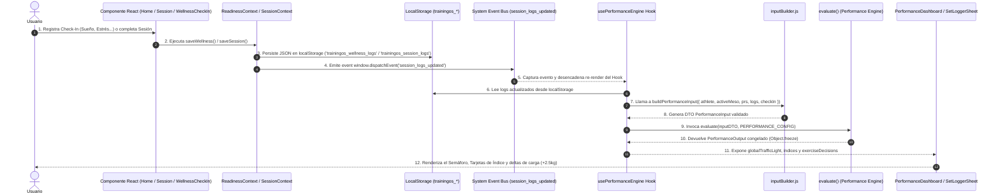

# DATA FLOW — END-TO-END SPECIFICATION

## 1. Recorrido Completo de los Datos
Este documento detalla la trayectoria exacta que recorre la información en TrainingOS desde que el usuario realiza una acción en la interfaz hasta que el motor de rendimiento procesa las métricas y actualiza las pantallas.

---

## 2. Etapas del Flujo

### 2.1. Captura de Datos de Entrada (UI & Contexts)
- **Check-in Diario**: El componente `WellnessCheckIn.jsx` captura Sueño (1-5), Estrés (1-5), Energía (1-5) y DOMS (1-5) y llama a `saveWellness()` en `ReadinessContext.jsx`.
- **Registro de Series**: Durante un entrenamiento en `Session.jsx`, el usuario edita Carga (kg), Reps, RPE y Velocidad en `SetLoggerSheet.jsx`. Al pulsar **Guardar Sesión**, `SessionContext.jsx` compila las series completadas y las guarda en `localStorage.getItem('trainingos_session_logs')`.

### 2.2. Eventos Reactivos de Sincronización
Inmediatamente tras guardar datos locales, `SessionContext` y `ReadinessContext` emiten eventos en el navegador:
- `window.dispatchEvent(new Event('session_logs_updated'))`
- `window.dispatchEvent(new CustomEvent('new_session_saved', { detail: logEntry }))`

### 2.3. Transformación DTO (`inputBuilder.js`)
El hook `usePerformanceEngine` reacciona al evento y llama a `buildPerformanceInput()`:
1. Mapea la disciplina activa del perfil (`'gym'`, `'tkd'`, `'all'`) a la enumeración del motor.
2. Agrupa el historial de sesiones por ejercicio y resuelve los metadatos desde `exerciseLibrary.js` (patrón de movimiento, coste sistémico, transferencia TKD).
3. Invierte la fatiga percibida para generar el marcador de energía biológica.

### 2.4. Ejecución del Performance Engine (`evaluate()`)
1. **Validación**: `validators.js` aplica valores por defecto a cualquier campo ausente.
2. **Cold Start**: Calcula la confianza según el número de días únicos de entrenamiento.
3. **Oleada 1**: Ejecuta `fatigueIndex`, `recoveryIndex` y `stimulusIndex`.
4. **Oleada 2**: Pasa los resultados de la Oleada 1 a `progressionIndex`, `patternBalanceIndex` y `sportTransferIndex`.
5. **Decision Engine**: Pasa todas las señales a `computeDecisions()` para consolidar el semáforo y las recomendaciones.

### 2.5. Renderizado en UI
El resultado retornado por `usePerformanceEngine` actualiza:
- El badge del semáforo global en `Home.jsx` y `PerformanceDashboard.jsx`.
- Las 6 tarjetas de índice en `PerformanceDashboard.jsx`.
- El badge de sobrecarga sugerida (ej. `🟢 +2.5kg`) en `SetLoggerSheet.jsx`.
