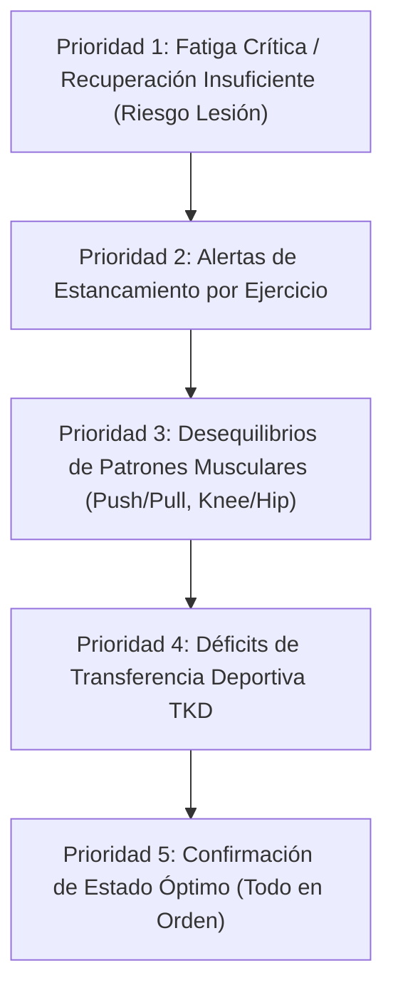

# DECISION ENGINE — FUNCTIONAL SPECIFICATION

## 1. Visión General
El **Decision Engine** (`src/engine/performance/core/decisionEngine.js`) es la capa de razonamiento sintético que toma los 6 índices calculados por el Performance Engine (Wave 1 + Wave 2) y genera:

1. **Un Semáforo Global Consolidado** (`color`, `label`, `simpleMessage`, `action`).
2. **Recomendaciones Explicables Priorizadas** (`critical`, `high`, `medium`, `low`).
3. **Decisiones de Progresión por Ejercicio** (`trafficLight`, `suggestedLoadDelta`, `isStagnating`, `reasoning`).

---

## 2. Jerarquía de Prioridades de Recomendaciones

El Decision Engine ordena las recomendaciones generadas para el atleta/entrenador según una escala estricta de prioridad de 1 a 5:



---

## 3. Reglas del Semáforo Global (`computeGlobalTrafficLight`)

El semáforo global sintetiza las señales de todas las métricas de la sesión:

### 3.1. Señal ROJA (🔴 Descanso Recomendado)
- **Criterios de Activación**:
  - Fatiga Sistémica ($IFS > 80$).
  - Recuperación Insuficiente ($IR < 0.35$ o $35\%$).
  - 2 o más ejercicios con señal de regresión (`red`) en el índice de progresión.
- **Acción Sugerida**: "Sesión de recuperación activa (movilidad, caminata) o descanso completo hoy."
- **Mensaje**: "Tu cuerpo necesita recuperarse hoy."

### 3.2. Señal AMARILLA (🟡 Entrenar con Moderación)
- **Criterios de Activación**:
  - Fatiga Elevada ($IFS > 60$).
  - Recuperación Moderada ($35\% \le IR < 70\%$).
  - 1 ejercicio con señal de regresión (`red`) o $IP < 40$.
- **Acción Sugerida**: "Sesión técnica o ligera. Evita cargas máximas hoy."
- **Mensaje**: "Entrena suave hoy."

### 3.3. Señal VERDE (🟢 Listo para Entrenar)
- **Criterios de Activación**:
  - Fatiga Controlada ($IFS \le 60$).
  - Recuperación Óptima ($IR \ge 70\%$).
  - Cero señales rojas en progresión.
- **Acción Sugerida**: "Puedes entrenar a plena intensidad según el plan."
- **Mensaje**: "Hoy puedes entrenar fuerte 💪"

---

## 4. Lógica de Cold Start (Inicio en Frío)
Cuando un atleta nuevo ingresa en la aplicación y tiene menos de 5 sesiones registradas en su historial:

1. **Detección**: `sessionCount < 5`.
2. **Multiplicador de Confianza**:
   - `0 sesiones`: Confianza $0.40$ (Baseline).
   - `1-2 sesiones`: Confianza $0.60$ (Aprendizaje inicial).
   - `3-4 sesiones`: Confianza $0.80$ (Fase parcial).
   - `5+ sesiones`: Confianza $1.00$ (Motor completo activado).
3. **Comportamiento**:
   - Atenúa los valores extremos jalando el resultado hacia el centro ($50$).
   - Muestra el `ColdStartBanner` ("Sesión X de 5").
   - El semáforo global no emite bloqueos críticos falsos por falta de historial.

---

## 5. Pseudocódigo Funcional del Decision Engine

```text
FUNCION computeDecisions(input, indices, config):
    inicializar recomendaciones = []

    // 1. REGLA DE FATIGA SISTÉMICA
    SI indices.fatigue.value > config.fatigue.thresholds.critical ENTONCES
        añadirRecomendacion(tipo='deload', prioridad='critical', accion='Semana de descarga reactiva')
    SINO SI indices.fatigue.value > config.fatigue.thresholds.high ENTONCES
        añadirRecomendacion(tipo='volume', prioridad='high', accion='Reducir 1-2 series por ejercicio')
    FIN SI

    // 2. REGLA DE RECUPERACIÓN / BIENESTAR
    SI indices.recovery.normalized < config.progression.trafficLight.red.maxRecoveryIndex ENTONCES
        añadirRecomendacion(tipo='recovery', prioridad='high', accion='Priorizar descanso hoy')
    FIN SI

    // 3. REGLA DE ESTÁNCAMIENTO POR EJERCICIO
    PARA CADA (ejercicioId, decision) EN indices.progression.exerciseDecisions HACER
        SI decision.isStagnating ES VERDADERO ENTONCES
            añadirRecomendacion(tipo='pattern', prioridad='high', ejercicioId=ejercicioId, accion='Cambiar de variante')
        FIN SI
    FIN PARA

    // 4. REGLA DE DESEQUILIBRIO DE PATRONES (IPB)
    PARA CADA alerta EN indices.patternBalance.alerts HACER
        añadirRecomendacion(tipo='pattern', prioridad=alerta.priority, accion=alerta.action)
    FIN PARA

    // 5. REGLA DE TRANSFERENCIA DEPORTIVA TKD (ITD)
    SI indices.sportTransfer NO ES NULL ENTONCES
        PARA CADA rec EN indices.sportTransfer.recommendations HACER
            añadirRecomendacion(tipo=rec.type, prioridad=rec.priority, accion=rec.action)
        FIN PARA
    FIN SI

    // 6. SÍNTESIS DE SEMÁFORO GLOBAL
    globalTrafficLight = computeGlobalTrafficLight(indices, config)

    // 7. COMPILAR DECISIONES POR EJERCICIO
    exerciseDecisions = buildExerciseDecisions(indices, input)

    RETORNAR { recommendations, globalTrafficLight, exerciseDecisions }
FIN FUNCION
```
