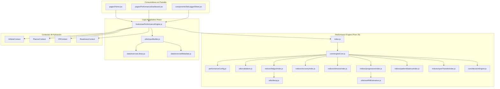

# DEPENDENCY GRAPH & CRITICAL PATH ANALYSIS

## 1. Grafo de Dependencias del Motor

---

## 2. Puntos Críticos de Fallo (Single Points of Failure)

1. **`src/engine/performance/core/engineCore.js`**:
   - *Riesgo*: Si este módulo falla o arroja una excepción no capturada, todo el cálculo del motor se detiene.
   - *Mitigación*: Capturado con `try/catch` dentro de `usePerformanceEngine.js`.

2. **`src/engine/performance/utils/inputBuilder.js`**:
   - *Riesgo*: Si los nombres de los campos de los Contexts React cambian (por ejemplo, `fecha` a `date`), el builder puede enviar campos `undefined` al motor.
   - *Mitigación*: `validators.js` aplica valores por defecto a todos los DTOs de entrada.

3. **`src/context/SessionContext.jsx`**:
   - *Riesgo*: Es el encargado de persistir los entrenamientos completados en `localStorage` y emitir el evento `session_logs_updated`. Si no emite el evento, los gráficos y el motor no se enteran de las nuevas sesiones hasta refrescar la página.

4. **`src/data/exerciseLibrary.js`**:
   - *Riesgo*: Si se añade un ejercicio nuevo sin especificar los campos `pattern`, `systemicCost` y `sportTransfer`, el motor usará los valores fallback predeterminados.

---

## 3. Matriz de Impacto de Cambios

| Módulo Modificado | Módulos Afectados Directamente | Riesgo de Regresión |
|---|---|---|
| `performanceConfig.js` | Todos los 6 índices y el Decision Engine. | 🔥 ALTO (Cambia los umbrales de semáforos) |
| `inputBuilder.js` | `usePerformanceEngine.js` | ⚡ MEDIO (Puede alterar el formato del DTO) |
| `engineCore.js` | `index.js`, `smoke.test.js`, `usePerformanceEngine.js` | 🔥 ALTO (Afecta el orden de la Oleada 1 y 2) |
| `SessionContext.jsx` | `Session.jsx`, `SetLoggerSheet.jsx`, `usePerformanceEngine` | ⚡ MEDIO (Afecta la sincronización local) |
| `exerciseLibrary.js` | `inputBuilder.js`, `exerciseMetadata.js` | 📘 BAJO (Añadir ejercicios es seguro) |
