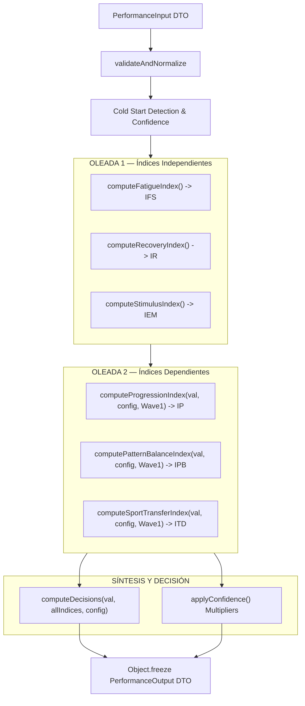

# PERFORMANCE ENGINE — TECHNICAL SPECIFICATION

## 1. Filosofía y Principios de Diseño
El **Performance Engine** es el motor analítico de autorregulación del entrenamiento de TrainingOS. 

### Principios Clave:
1. **Desacoplamiento Total**: Diseñado como un motor JavaScript puro en `src/engine/performance/`. Cero dependencias de React, DOM o APIs del navegador.
2. **Determinismo**: Mismas entradas $\rightarrow$ Mismas salidas. No utiliza aleatoriedad ni llamadas asíncronas.
3. **Inmutabilidad**: La salida devuelta por `evaluate()` está congelada con `Object.freeze()`.
4. **Cálculo en 2 Oleadas (Waves)**:
   - **Oleada 1 (Independientes)**: Se calculan los índices primarios directos de la fisiología del atleta (Fatiga, Recuperación y Estímulo).
   - **Oleada 2 (Dependientes)**: Se calculan los índices contextuales (Progresión, Equilibrio de Patrones y Transferencia TKD) utilizando los resultados obtenidos en la Oleada 1.

---

## 2. Diagrama de Ejecución del Motor

---

## 3. Especificación Detallada de los 6 Índices

### 3.1. IFS — Índice de Fatiga Sistémica (`fatigueIndex.js`)
- **Finalidad**: Medir el estrés neuromuscular y la carga de fatiga acumulada en los últimos 7 y 28 días (ratio agudo:crónico).
- **Entradas**: `exerciseHistory[].sessions[].sets` (`systemicCost`, `load`, `reps`, `rir`, `rpe`).
- **Cálculo**:
  - Calcula la fatiga por sesión $F_{session} = \sum (\text{load} \times \text{reps} \times \text{systemicCost} \times \text{rirMultiplier})$.
  - Aplica decaimiento exponencial (`decay.js`) con una vida media de 7 días.
  - Compara la carga aguda (7 días) contra la carga crónica (28 días) obteniendo el ratio ACWR (Acute:Chronic Workload Ratio).
- **Salida**: Objeto `{ value: 0-100, label: 'Bajo'|'Moderado'|'Alto'|'Crítico', detail: string }`.
- **Dependencias**: `decay.js`.

### 3.2. IR — Índice de Recuperación (`recoveryIndex.js`)
- **Finalidad**: Cuantificar la disponibilidad biológica y subjetiva del atleta para tolerar carga en el día actual.
- **Entradas**: `wellbeing` (`sleep`, `stress`, `energy`, `muscleSoreness`).
- **Cálculo**:
  - Pondera los marcadores de bienestar: Sueño (30%), Estrés (25%), Energía (25%), DOMS (20%).
  - Normaliza la puntuación total en una escala de 0.0 a 1.0 (y 0 a 100).
  - Si `wellbeing` es `null`, asigna valor por defecto de `60` con etiqueta `'Sin datos'`.
- **Salida**: Objeto `{ value: 0-100, normalized: 0.0-1.0, label: string, detail: string }`.
- **Dependencias**: Ninguna (Wave 1).

### 3.3. IEM — Índice de Estímulo Muscular (`stimulusIndex.js`)
- **Finalidad**: Medir si el volumen semanal de series efectivas por patrón de movimiento alcanza los umbrales de mantenimiento y adaptación.
- **Entradas**: `exerciseHistory`, `VALID_PATTERNS`.
- **Cálculo**:
  - Filtra las series efectivas (series con RIR $\le 4$ o RPE $\ge 6$) realizadas en los últimos 7 días.
  - Agrupa las series por patrón de movimiento (`knee_dominant`, `hip_dominant`, `push_horizontal`, etc.).
  - Compara las series realizadas contra el volumen mínimo de mantenimiento (MEV) prescrito en `performanceConfig.js`.
- **Salida**: Objeto `{ value: 0-100, label: string, coverages: Object, detail: string }`.
- **Dependencias**: Ninguna (Wave 1).

### 3.4. IP — Índice de Progresión (`progressionIndex.js`) — Oleada 2
- **Finalidad**: Evaluar la tendencia de progresión o estancamiento ejercicio por ejercicio.
- **Entradas**: `exerciseHistory`, `wave1` (`fatigue`, `recovery`).
- **Cálculo**:
  - Para cada ejercicio con historial, estima la tendencia de 1RM utilizando la fórmula de Epley/Wathan (`oneRMEstimators.js`).
  - Analiza el RIR/RPE de las últimas 3 sesiones.
  - Asigna semáforo por ejercicio:
    - **`green`**: Recuperación $\ge 70\%$, fatiga $\le 75\%$, RPE en rango $\rightarrow$ Sugiere $+2.5\text{ kg}$.
    - **`yellow`**: Recuperación o RPE moderado $\rightarrow$ Sugiere mantener carga ($0\text{ kg}$).
    - **`red`**: RIR 0 sostenido o fatiga alta $\rightarrow$ Sugiere reducción de carga ($-2.5\text{ kg}$ a $-5.0\text{ kg}$).
  - Detecta estancamiento (`isStagnating`) si no hay progresión en $\ge 3$ sesiones consecutivas.
- **Salida**: Objeto `{ value: 0-100, exerciseDecisions: Map<exerciseId, Decision> }`.
- **Dependencias**: Wave 1 (`fatigue`, `recovery`), `oneRMEstimators.js`.

### 3.5. IPB — Índice de Equilibrio de Patrones (`patternBalanceIndex.js`) — Oleada 2
- **Finalidad**: Detectar desequilibrios estructurales de volumen entre patrones antagonistas en los últimos 28 días.
- **Entradas**: `exerciseHistory`, `wave1`.
- **Cálculo**:
  - Calcula ratios de series efectivas acumuladas:
    - **Push : Pull**: Ideal $1.0 : 1.0$ (Rango aceptable $0.8 - 1.2$).
    - **Knee : Hip**: Ideal $1.0 : 1.0$ (Rango aceptable $0.8 - 1.2$).
    - **Bilateral : Unilateral**: Ideal $2.0 : 1.0$.
  - Si un ratio supera los límites, genera alertas con prioridad (`high`/`critical`) y acciones correctivas.
- **Salida**: Objeto `{ value: 0-100, ratios: Object, alerts: Array<Alert> }`.
- **Dependencias**: Wave 1 (`stimulus`).

### 3.6. ITD — Índice de Transferencia Deportiva TKD (`sportTransferIndex.js`) — Oleada 2
- **Finalidad**: Evaluar la contribución del entrenamiento de fuerza a los 4 pilares atléticos del Taekwondo.
- **Entradas**: `exerciseHistory`, `athlete.sport`.
- **Cálculo**:
  - Si `athlete.sport === 'gym'`, devuelve `null` inmediatamente.
  - Evalúa los 4 pilares TKD:
    1. **Explosividad**: Patrones `knee_dominant` / `hip_dominant` con alto `sportTransfer`.
    2. **Trabajo Unilateral**: Patrón `unilateral`.
    3. **Movilidad**: Ejercicios de prioridad `'mobility'` o `hip_dominant`.
    4. **Core Rotacional**: Patrones `rotation` y `anti_rotation`.
  - Genera recomendaciones específicas de ejercicios de transferencia si un pilar está por debajo del $40\%$.
- **Salida**: Objeto `{ value: 0-100, pillarScores: Object, recommendations: Array } | null`.
- **Dependencias**: Wave 1 (`stimulus`).

---

## 4. Orquestación y Módulos Auxiliares

### 4.1. `evaluate(input, config)` — `engineCore.js`
Es la función principal de entrada.
1. Valida y normaliza el input mediante `validators.js`.
2. Calcula el número de sesiones únicas y determina el multiplicador de confianza de **Cold Start** (`0.4` a `1.0`).
3. Ejecuta la **Oleada 1** (`fatigue`, `recovery`, `stimulus`).
4. Ejecuta la **Oleada 2** (`progression`, `patternBalance`, `sportTransfer`) pasando el resultado de la Oleada 1.
5. Aplica la atenuación por confianza a todos los índices.
6. Invoca el `computeDecisions()` del Decision Engine.
7. Retorna un `PerformanceOutput` inmutable congelado con `Object.freeze()`.

### 4.2. `inputBuilder.js`
Modulo adaptador que transforma los objetos heterogéneos de los contextos de React (`AthleteContext`, `PlannerContext`, `PRContext`, `ReadinessContext`) al DTO estandarizado `PerformanceInput`.
